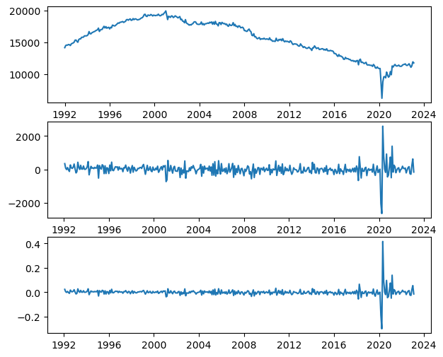
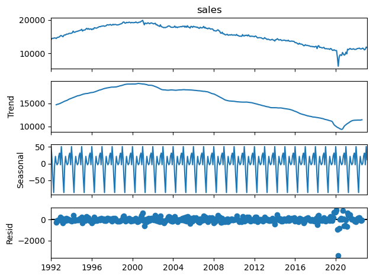
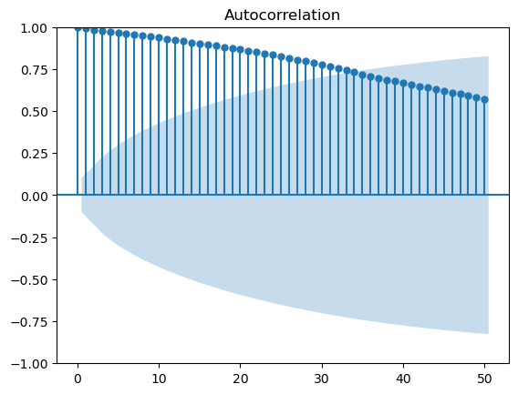
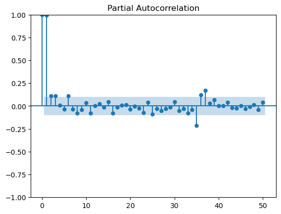

# US Department Stores Time  Series Analysis

## Overview & Problem Statement
In this project, we will develop a time series analysis and forecasting model that accurately predicts the overall retail channel sales for department stores in the US, using the US Census Monthly Retail Sales data. The model should take into account factors such as seasonality, trends, and holidays, and should be trained and tested on historical sales data to optimize its performance.
The outcome of this project will provide valuable insights into the underlying patterns and trends in the data, allowing department stores to make informed decisions about their sales strategies, inventory management, pricing, and marketing efforts. By accurately forecasting overall retail channel sales, department stores can enhance their profitability and competitiveness in the market.

---

## Data
This project uses datasets from [US Census - Monthly Sales for Retail and FoodServices](https://www.census.gov/econ/currentdata/). This provides monthly estimates on department store sales . Also, company financial reports from Macy's, Kohl's Corporation, Nordstrom, and Dillard's are utilized in visualizing the retail performance of department stores in the US.

---

## Time Series Analysis
**Trends**:  A clear trend in department store sales is observed, especially after 2000. Sales showed consistent growth until 2000, after which they started declining. The COVID-19 pandemic caused a significant drop in sales in 2020, but they quickly rebounded and returned to pre-pandemic levels within a year. 

**Seasonality**: T The data exhibits evident seasonality, indicating recurring patterns in department store sales. Sales reach peaks approximately every twelve months, suggesting certain months or seasons consistently generate higher sales volumes compared to others.

**Autocorrelation**: The autocorrelation function (ACF) plot demonstrates a strong correlation between department store sales over time. Positive autocorrelation indicates that once a trend is established, sales tend to continue increasing or decreasing. In other words, when sales show an upward trend, they are likely to keep increasing, and similarly, when sales decline, they tend to continue decreasing. 

Additionally, the partial autocorrelations (PACF) plot shows that lags 1 and 2 are statistically significant, while the partial autocorrelations for lags 3 and 4 are close to the significant limits. This implies that the values of partial autocorrelation at these lags are unlikely due to random chance.

---

## Tableau 
In addition to tme series analysis using Python, we also used Tableau for visualizing the department store retail performance in the US. 

- [US Department Store Retail Performance | EDA](https://public.tableau.com/views/USDepartmentStoreSalesAnalysis/D_USRetailStoreSales?:language=en-US&:display_count=n&:origin=viz_share_link): The line and bar charts in the dashboard depict the channel sizes of U.S. department stores and their growth rate spanning from 1992 to 2022
 
- [US Retail Store Sales by Major Department Stores](https://public.tableau.com/views/USDepartmentStoreSalesAnalysis/D_USRetailStoreSalesbyMajorPlayer?:language=en-US&:display_count=n&:origin=viz_share_link): The multiple line charts in the this dashboard display the retail store sales for major department stores in the US in 2011-2022.

---

## Model Building and Evaluation 
For data modeling, the following models were applied: Linear model, Autoregressive Integrated Moving Average with Exogenous Variables (ARIMAX) model, and Seasonal Autoregressive Integrated Moving Average with Exogenous Variables (SARIMAX) model. 

Here are the scores and metrics for models: 

|Model|R2|RMSE|AIC|MAE|
|--|--|--|--|--|
|Linear model|0.675|581.987|966.967|306.025|
|ARIMA model(4,1,3)|-0.342|1181.795|3981.306|966.768|
|SARIMAX model(4,1,3)|-1.593|1642.587|3876.310|1165.682|

Based on the metrics table, the linear model seems to be performing the best out of the three models. The linear model has the highest R2 score and lowest RMSE value and AIC value. ARIMA and SARIMAX had negative R2 scores, meaning that they are performing worse than a model that simply predicts the mean of the target variable. They also have much higher RMSE and AIC values compared to the linear model.

---

## Conclusion & Recommendations
**Conclusion**
The linear model seems to be performing the best out of the three models. The linear model has the highest R2 score and lowest RMSE value and AIC value. ARIMA and SARIMAX had negative R2 scores, meaning that they are performing worse than a model that simply predicts the mean of the target variable. They also have much higher RMSE and AIC values compared to the linear model.

**Recommendation**
It is recommended to use the linear model for forecasting sales for department stores in the US. However, further analysis should be conducted to ensure the robustness and accuracy of the model. For example, the model could be tested on more recent data to validate its performance and adjust it accordingly. Additionally, other models and techniques could be explored to improve the accuracy of the forecast and provide additional insights for department stores to optimize their sales strategies.

---

## Data Dictionary
|Feature|Type|Dataset|Description|
|---|---|---|---|
|date|object|4521_department_stores|date|
|sales|int64|4521_department_stores|deparment stores retail sales, seasonally adjusted (millions of US dollars)|
|Macy's|int64|department_store_company_sales.csv|Macy's annual sales revenues (FY-Jan)|
|Kohl's Corporation|int64|department_store_company_sales.csv|Kohl's Corporation annual sales revenues (FY-Jan)|
|Nordstrom|int64|department_store_company_sales.csv|Nordstrom  annual sales revenues (FY-Jan)|
|Dillard's|int64|department_store_company_sales.csv|Dillard's  annual sales revenues (FY-Jan)|